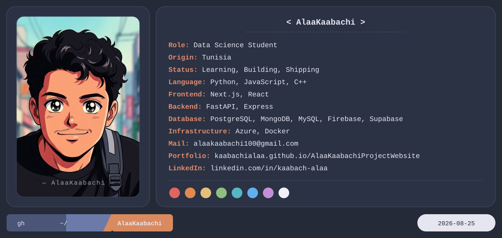

# Hi, I'm Alaa Kaabachi 👋
### Student in Big Data & Data Analysis | Data Science Master's Student

 

---

## 📌 About Me

Currently pursuing a **Research Master's in Data Science and Information Retrieval (DSIR)** at the
**Higher Institute of Multimedia Arts of Manouba (ISAMM)**.
Passionate about software development, data analysis, and machine learning.

- 🎓 Bachelor's Degree in Big Data and Data Analysis (2022–2025)
- 🔬 Research Master's in Data Science and Information Retrieval (2025–2027) — *in progress*
- 📍 Based in Ben Arous, Tunisia
- 💬 Ask me about Python, SQL, Power BI, Tableau, and ML basics

---

## 🛠️ Skills

---

### 📫 Let's Connect

